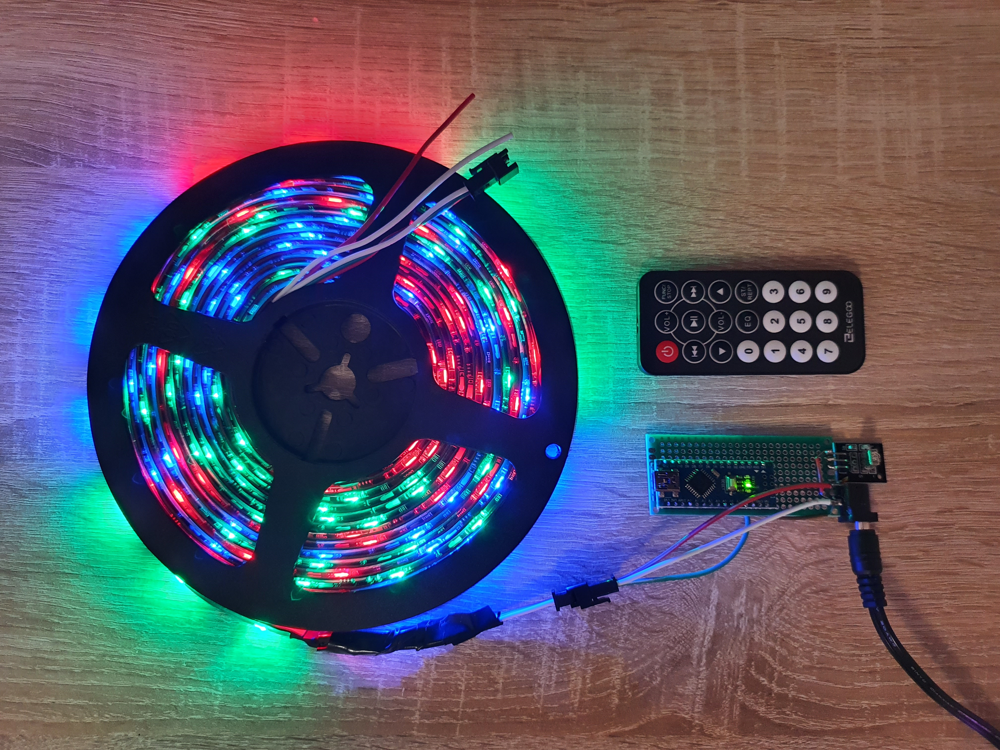
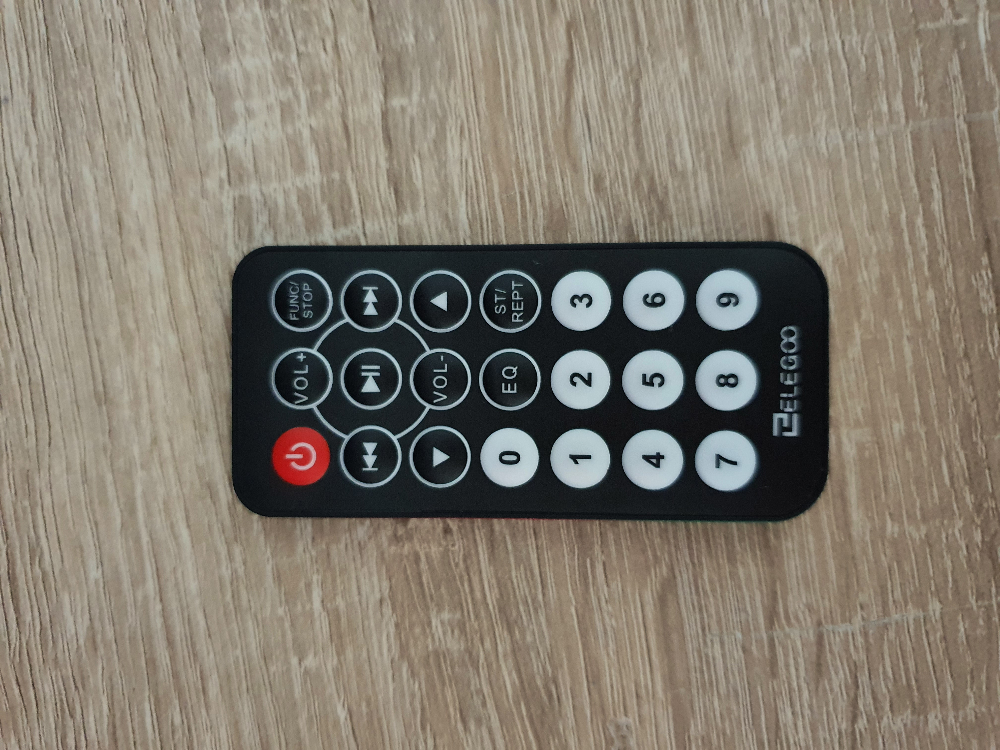
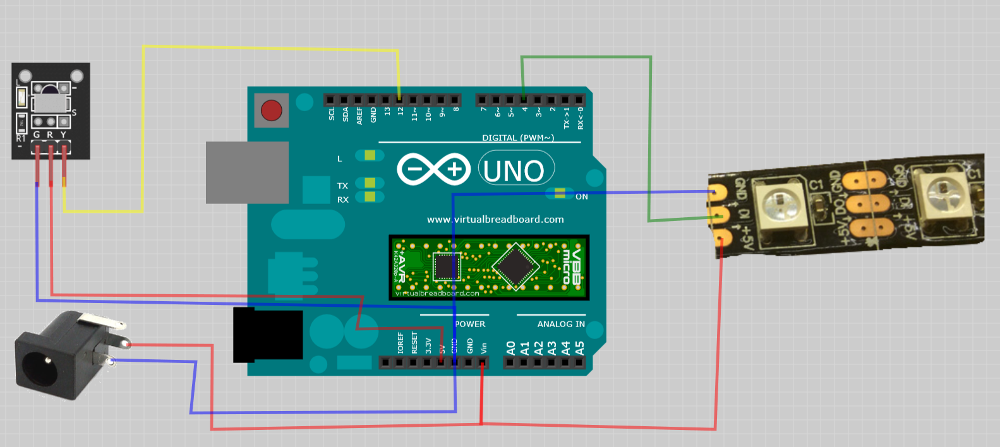

# Arduino LED Strip

Remote controllable LED strip with set of 10 unique animations and 34 variants overall.

Animations include:
* Fade in/out (7 variants)
* Running light (7 variants)
* Looped sequence (1 variant)
* Smooth color change  (1 variant)
* Random colors  (1 variant)
* Even and odds (1 variant)
* Jump left-right (7 variants)
* Racing (7 variants)
* Blast wave (1 variant)
* Stacking colors (1 variant)

The LED strip is controlled by an ifrared remote control.

Additional functions are:
* Switch on/off
* Control of brightness (4 levels)
* Control of animation speed (5 levels)
* Random animation switch by timeout (1 minute)
* Activation/deactivation by timeout.

Remote control provides the following functions:

* POWER - Switch on/off
* VOL+/VOL- - Adjust briteness.
* UP/DOWN - Adjust animation speed.
* FAST FORWARD/BACK - Select animation variant (color).
* ST/REPT - Toggle random animation mode (every minute). When pressing the button a double blink indicates that the switch mode is turned on and a single blink - turned off.
* 0-9 - Select animation scenario.

Activation and deactivation by timeout is adjusted using ACTIVITY_PERIOD and TOTAL_PERIOD variables. By default the LED strip is active 6 hours after startup and then switches off for 18 more hours.

### Equipment
* Arduino Nano Atmega328P - x1
* KY-022 Infrared Receiver Module - x1
* Remote control (see picture) - x1
* WS2811 RGB LED strip (12V/3A) 150 LEDs grouped by 3 - 1x
* Perfboard 7x3cm (24x10 holes + 2x8 side connectors) - x1
* Wires - x5
* 12V/3A DC Power supply (DC-005 male plug) - x1
* DC-005 feemale plug - x1
* Soldering set (iron, solder, flux, e.t.c.) - x1
* USB Cable - x1

⚠️⚠️⚠️ If you use a non-original Arduino Nano based on CH340/CH341 USB chip, you need to dowload drivers from http://www.wch.cn/download/CH341SER_EXE.html, otherwise Arduino studio does not recongnize the board.

⚠️⚠️⚠️ Make sure you use correct version of IRremote. Elegoo tutorial supplies older version that is not compatible with this sketch.

### Circuit Diagram

⚠️ Note that you need 12V/3A LED strip, not 5V. The image in the cirquit diagram is only a pin connection reference.

### Tools
* Arduino Studio 1.8.14

### Optional
* Virtual Breadboard 1.5.0 - to open and modify the circuit diagram

### Flash
* Connect the microcontroller via USB
* Open src/arduino-led-strip/arduino-led-strip.ino in Arduino Studio
* Go to Sketch -> Include Library -> Use ZIP Library...
* Select src/FastLED-3.4.0.zip and src/IRremote-3.3.0.zip libraries
* Compile and flash the sketch
